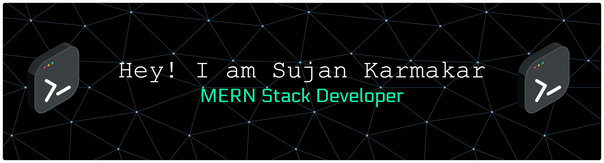

# 

    <h1>
        
    </h1>

#  About Me 

I'm currently a CSE student at HETC with 8.5 CGPA.

* Mainly working on **Web Development** projects.

  
* Grinding **DSA using C++** to get better at problem-solving.

  
* Interested in **AI/ML**.

 

---

##  Tech Stack

    

  

&nbsp;&nbsp;

&nbsp;&nbsp;

&nbsp;&nbsp;

&nbsp;&nbsp;

&nbsp;&nbsp;

&nbsp;&nbsp;

&nbsp;&nbsp;

&nbsp;&nbsp;

&nbsp;&nbsp;

&nbsp;&nbsp;

&nbsp;&nbsp;

&nbsp;&nbsp;

&nbsp;&nbsp;

&nbsp;&nbsp;

&nbsp;&nbsp;

&nbsp;&nbsp;

&nbsp;&nbsp;

&nbsp;&nbsp;

&nbsp;&nbsp;

&nbsp;&nbsp;

&nbsp;&nbsp;

&nbsp;&nbsp;

---

### 🏆 Highlighted Projects:

| Repo Card | Live Link |
| :--- | :---: |
|  |  |
|  |  |

---

### 🧩 Problem Solving & Competitive Programming

    

  
  &nbsp;&nbsp;&nbsp;&nbsp;
  

 

  <!-- Left Side: Badges & Certificates -->
  
        
        &nbsp; &nbsp;
        
            
        
          
      

          
          
          
          
          
      

  
  &nbsp;&nbsp;&nbsp;&nbsp;&nbsp;&nbsp;&nbsp;&nbsp;

 

---

##  Github Activity

  
  

| Stats | Streak |
| :---: | :---: |
|  |  |

    

---

### 🐍 My Contribution Streak:

  

---

##  Contact Me

  

